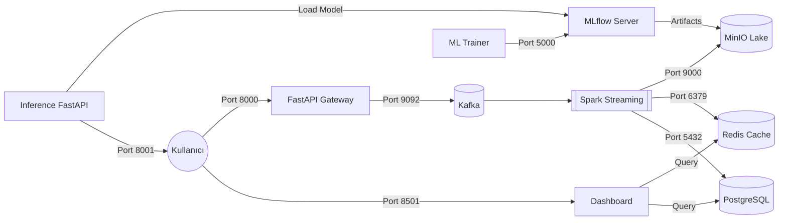

# 🛸 RadarPro: Deployment Mimarisi & Docker Servis Haritası

RadarPro sistemi, mikroservis mimarisi üzerine kurulu, Docker tabanlı ve saniyelik veri işleme kapasitesine sahip bir "Real-Time Intelligence" platformudur. Bu döküman, sistemdeki tüm teknolojilerin (PostgreSQL, MLflow, FastAPI, Spark, Kafka, Redis vb.) nasıl bir araya geldiğini ve hangi portlarda çalıştığını detaylandırır.

## 🛳️ Docker Servis Haritası & Port Bağlantıları

Aşağıdaki tablo, sistemdeki tüm konteynerları ve görevlerini listeler:

| Servis Adı | Teknoloji | Port(lar) | Görev / Responsibility |
| :--- | :--- | :--- | :--- |
| **api_gateway** | **FastAPI** | `8000` | Veri alımı (Ingestion) ve kullanıcı yetkilendirme. |
| **inference_api** | **FastAPI** | `8001` | ML model tahminlerini servis eden uç nokta. |
| **dashboard** | **Streamlit** | `8501` | Kullanıcı arayüzü ve gerçek zamanlı grafikler. |
| **postgres** | **TimescaleDB** | `5432` | Zaman serisi veri tabanı ve kullanıcı kayıtları. |
| **mlflow_server** | **MLflow** | `5000` | Model takibi, versiyonlama ve kayıt (Registry). |
| **redis_cache** | **Redis** | `6379` | <10ms gecikmeli arbitraj ve sinyal önbelleği. |
| **minio** | **MinIO (S3)** | `9000/9001` | Parquet veri gölü (Data Lake) ve model deposu. |
| **kafka** | **Apache Kafka** | `9092` | Canlı veri akışı ve mesaj kuyruğu. |
| **spark-silver** | **Apache Spark** | *Internal* | Anlık veri temizleme ve fiyat farkı hesaplama. |
| **db_admin** | **Adminer** | `8080` | Veritabanı yönetim arayüzü. |
| **kafdrop** | **Kafka UI** | `9010` | Kafka topic ve mesaj izleme ekranı. |

---

## 🏗️ RadarPro Servis Bağlantı Şeması

Bu şema, servislerin birbiriyle nasıl konuştuğunu ve veri akış yönünü gösterir:

---

### 🎨 Görsel Servis Haritası (RadarPro View)

Sistemin "Professional Deployment" görünümü aşağıdaki gibidir:

---

### 💡 Mimari Notlar:
- **FastAPI Gücü**: Ingestion ve Inference için ayrı FastAPI servisleri kullanılarak, yoğun yük anında sistemin ölçeklenebilirliği (horizontal scaling) sağlanmıştır.
- **TimescaleDB & PostgreSQL**: Standart PostgreSQL üzerine TimescaleDB eklentisi kurularak saniyelik milyonlarca mum grafiği verisinin ultra hızlı sorgulanması sağlanmıştır.
- **MLflow**: Modellerin başarısını (Accuracy, Loss) takip etmek ve en iyi modeli canlıya almak için kullanılır.

> [!NOTE]
> `docker-compose ps` komutu ile tüm bu servislerin anlık durumunu terminal üzerinden izleyebilirsiniz.
