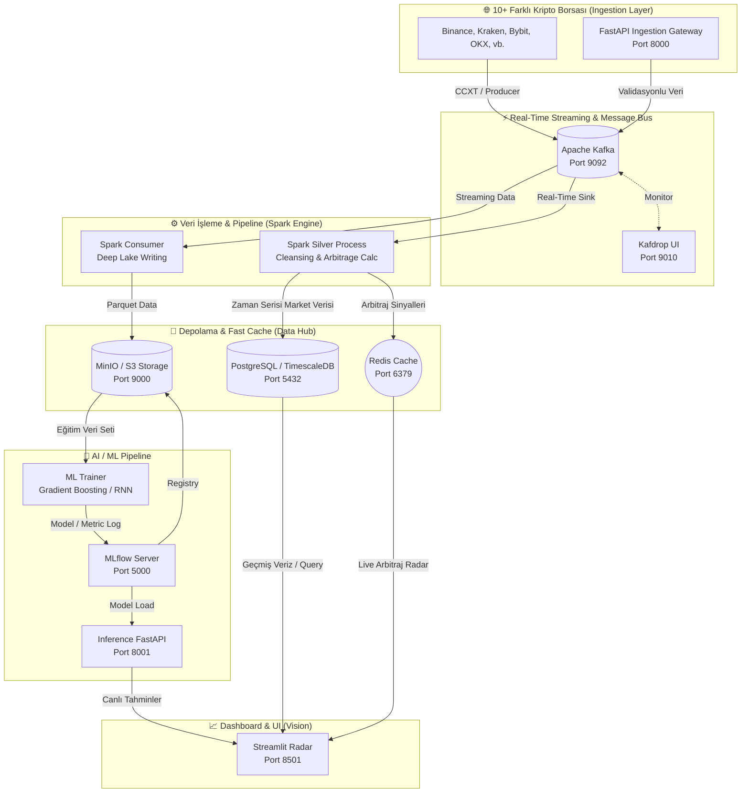
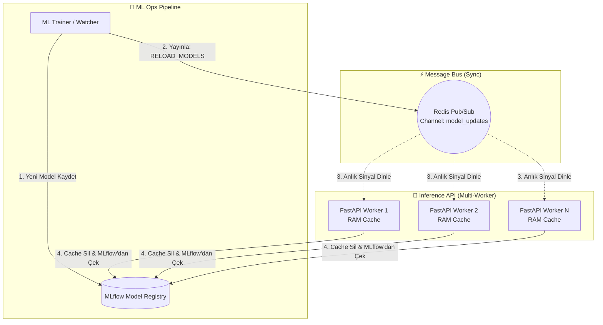
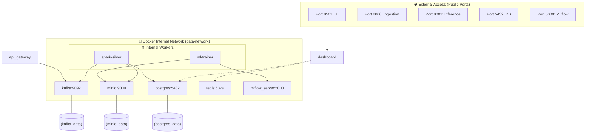
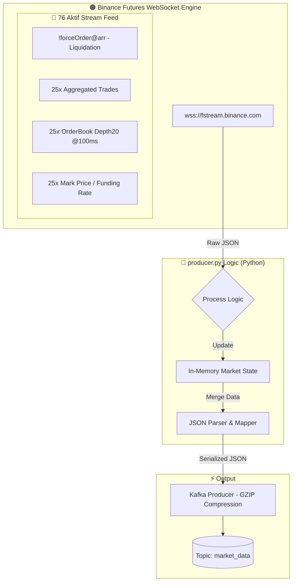

# 🚀 RadarPro: Uçtan Uca Sistem Mimarisi & Servis Bağlantı Haritası

Bu döküman, RadarPro platformunun **10+ farklı kripto borsasından** veri çekişinden başlayarak, **Makine Öğrenmesi** ve **Gerçek Zamanlı Arbitraj** çıktılarına kadar olan tüm teknolojik katmanlarını tek bir "Servis Bağlantı Haritası" üzerinde birleştirir.

---

## 📊 Entegre Sistem Mimari Şeması (Master Connection Map)

Aşağıdaki şema, verinin tüm duraklarını ve servislerin birbiriyle olan saniyelik etkileşimlerini gösterir:

---

## 🛠️ Teknoloji Yığın Portları ve Sorumlulukları

| Katman | Teknoloji | Port | Sorumluluk |
| :--- | :--- | :--- | :--- |
| **Ingestion** | **FastAPI** | `8000` | Dış dünyadan veri kabulü ve güvenlik. |
| **Predict** | **FastAPI** | `8001` | Modellerin AI tahminlerini dışa açma. |
| **Tracking** | **MLflow** | `5000` | Modellerin "hangi sürüm daha iyi?" takibi. |
| **DB (SQL)** | **Postgres (TSDB)** | `5432` | Milyonlarca satır market verisinin ultra-hızlı sorgulanması. |
| **Cache** | **Redis** | `6379` | <10ms arbitraj sinyal radarı. |
| **Lake** | **MinIO** | `9000` | Büyük verilerin (Parquet) ve modellerin saklanması. |
| **Stream** | **Kafka** | `9092` | Sistemin atardamarı; veriyi kayıpsız taşır. |
| **UI** | **Streamlit** | `8501` | Analistin tüm sistemi yönettiği ana kontrol merkezi. |

---

### 🎨 RadarPro: Profesyonel Bakış (3D Mockup)

Aşağıdaki görsel, sistemin katmanlı ve birbirine bağlı mikroservis yapısını en üst düzeyde temsil eder:

### 💡 Mimari Güç Noktaları:
- **Hızlı Arbitraj**: Borsa verileri Kafka -> Spark -> Redis hattından geçerek milisaniyeler içinde dashboard'a uçarak arbitraj fırsatını kaçırmamanızı sağlar.
- **Güvenli API**: Ingestion API (FastAPI) ile sisteme giren her veri otomatik olarak şemaya göre valide edilir.
- **Model Versiyonlama**: MLflow sayesinde sistemde her zaman "En İyi Performans Gösteren (Champion)" model otomatik olarak aktif edilir.

---

## 🔄 Şekil 4.2: inference_api.py — Redis Pub/Sub ile Zero-Downtime Model Güncelleme Akışı

RadarPro, canlı sistemde çalışan Makine Öğrenmesi modellerini güncellemek için sunucuyu kapatıp açmaya gerek duymaz. Bu "Sıfır Kesinti" (Zero-Downtime) mekanizması, **Redis Pub/Sub** üzerinden tüm worker'lara anlık sinyal gönderilmesiyle sağlanır.

### 🔌 Model Güncelleme Mekanizması (Graph TD)

### 🛠️ Teknik İşleyiş Adımları:
1.  **Model Kaydı**: `ml_watcher.py` yeni ve daha başarılı bir model eğittiğinde bunu MLflow'a `Production` tag'i ile kaydeder.
2.  **Sinyal Yayınlama**: Kayıt işlemi biter bitmez Redis üzerindeki `model_updates` kanalına `RELOAD_MODELS` mesajı gönderilir.
3.  **Anlık Yakalama**: Arka planda çalışan `asyncio` tabanlı Redis dinleyicisi bu mesajı yakalar.
4.  **RAM Cache Temizliği**: API'nin içindeki `model_cache` global değişkeni temizlenir.
5.  **Dynamic Loading**: İlk gelen prediction isteğinde, yeni model MLflow'dan saniyeler içinde RAM'e çekilir ve tahmin işlemi kesintisiz devam eder.

---

## 🏗️ Şekil 4.3: Docker Compose — Konteyner Ağı ve Servisler Arası Bağlantı Mimarisi

RadarPro sistemi, tüm mikroservislerin güvenli ve hızlı bir şekilde haberleşebilmesi için izole bir **Docker Bridge Network** (`data-network`) kullanır. Bu ağ içerisinde servisler birbirlerine IP adresleri yerine konteyner isimleri (Service Discovery) üzerinden erişirler.

### 🔌 Ağ ve Bağlantı Şeması

### 🛠️ Kritik Ağ Özellikleri:
1.  **Service Discovery**: Kod içerisinde veritabanına bağlanırken `localhost` yerine `postgres` host adının kullanılması Docker tarafından otomatik yönetilir.
2.  **İzolasyon**: `zookeeper` gibi dış dünyaya kapalı servisler sadece iç ağdan erişilebilir, bu da sistem güvenliğini artırır.
3.  **Persistency (Hacimler)**: Konteynerlar silinse bile veriler fiziksel hacimlerde korunur.

---

## 📈 Şekil 6.1: producer.py — Binance Futures 76-Stream WebSocket Veri Toplama Mimarisi

Sistemin veri giriş (Ingestion) katmanındaki en kritik bileşenlerden biri olan `producer.py`, Binance vadeli işlemler (Futures) borsasından **76 farklı veri akışını (stream)** tek bir WebSocket bağlantısı üzerinden eşzamanlı olarak toplar.

### 🔬 Teknik Detaylar:
- **Bağlantı Türü**: Binance Futures Multi-Stream WebSocket (`wss://fstream.binance.com/stream`)
- **Stream Yapısı**: 
    - `25 Coin x 3 Stream` (aggTrade, depth20, markPrice) = **75 Stream**
    - `!forceOrder@arr` (Küresel Likidasyon Akışı) = **1 Stream**
    - **Toplam**: **76 Aktif Stream**

### 🎯 Veri Toplama Stratejisi:
1.  **Likidasyon Takibi**: `!forceOrder@arr` ile marketteki tüm büyük tasfiyeler anlık yakalanır.
2.  **OrderBook Analizi**: Her coin için derinlik tablosu saniyede 10 kez (`100ms`) güncellenerek "duvarlar" (buy/sell walls) tespit edilir.
3.  **İmbalans Hesaplama**: Alış ve satış emirleri arasındaki dengesizlik (Imbalance Ratio) anlık hesaplanarak Kafka'ya iletilir.
4.  **Performans**: Veriler Kafka'ya iletilirken `GZIP` sıkıştırması kullanılarak network trafiği minimize edilir.
